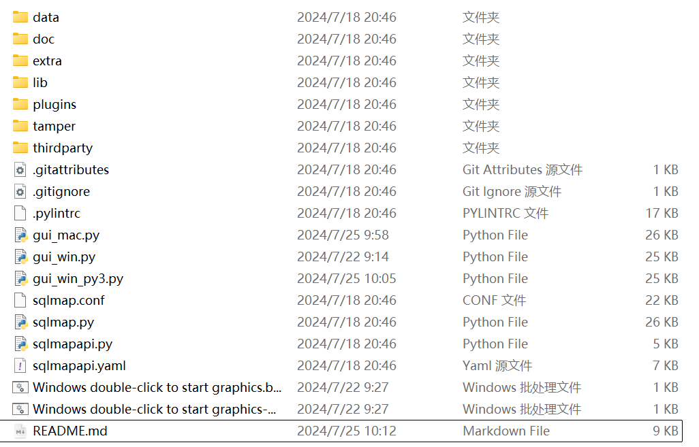
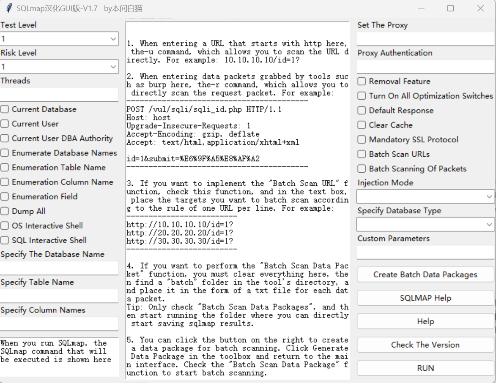
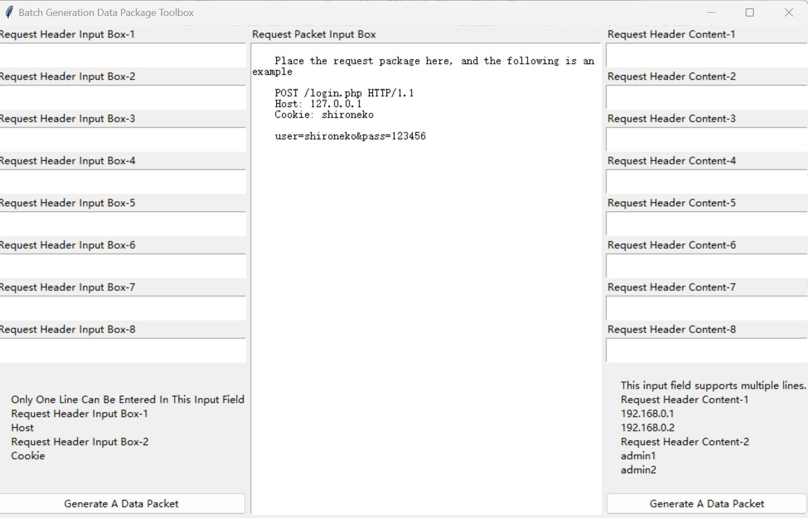

# Broken Thoughts

 SQLmap is popular among users as a powerful tool for testing SQL injection. However, it only has a command-line mode and requires a large number of commands to be written down and repeated input of commands, so this tool came into being.

# **Tool Describes**

 The pre-configured GUI file launches directly into graphical mode, allowing quick execution of commands through simple mouse clicks to select parameters. It also supports batch and concurrent scanning of URLs and Burp request packets through script development, providing convenience for large-scale detection of SQL injection vulnerabilities. Additionally, it is compatible with the three major operating systems: Windows, Linux, and Mac.

# Get Started Quickly

Quark Network Disk：https://pan.quark.cn/s/39b4b5674570#/list/share

Github：https://github.com/honmashironeko/sqlmap-gui/

Baidu Network Disk：https://pan.baidu.com/s/1C9LVC9aiaQeYFSj_2mWH1w?pwd=13r5/

Go to any of the three download addresses to obtain this tool and extract the compressed package. You will receive the SQLMAP application itself and the main body of this tool.

Since this tool involves third-party libraries, please run the following command in cmd to install the third-party libraries:`pip install requests`

### Usage on Windows

Decide which program to use according to your python environment. Normally, you use python XX.py to run the py file. You can double click Windows and start to it. If you want python3XX.py, you can use Windows to double click to start.

**Usage on Mac、Linux

Double-click the `gui_mac.py` file to launch the tool, or run `gui_mac.py` in the command line.

**Basic Usage Instructions**

 Select the command on the left, fill in the data packet captured by burp, and click Start Run!

This tool also provides the function of batch making request packages. Click "Make Batch Data Packages" on the main interface, enter the production workbench, follow the prompts to fill in the corresponding content and generate a data package. Return to the main interface and check "Batch Scan Data Packages" to start running. Sites where vulnerabilities are detected will be extracted into the ldopt folder.

# Help

 The graphical interface is divided into three parts. The left part is the database-related operation module, the middle is the data packet and URL filling module, and the right is the miscellaneous module.

**Introduction to the content of the left module**

- **Test Level**: Selectable from levels 1 to 5; higher levels include more extensive SQL statement testing.
- **Risk Level**: Selectable from levels 1 to 3; level 1 uses relatively safe syntax, while level 3 uses very dangerous syntax.
- **Number of Threads**: Selectable from 1 to 20 threads; SQLmap typically limits the maximum number of threads to 20.
- **Current Database**: Execute the `--current-db` command to see which database is currently being used.
- **Current User**: Execute the `--current-user` command to see which user is currently being used.
- **DBA Privileges for Current User**: Execute the `--is-dba` command to check if the current user has DBA privileges.
- **Enumerate Database Names**: Execute the `--dbs` command to list all database names.
- **Enumerate Table Names**: Execute the `--tables` command, specifying the database name to list all table names within that database. (Without specifying a database, it will list tables across all databases.)
- **Enumerate Column Names**: Execute the `--columns` command, specifying the database name and table name to list all column names within that table. (Without specifying a table, it will list columns across all tables.)
- **Enumerate Fields**: Execute the `--dump` command, specifying the database name, table name, and column name to list all fields within that column. (Without specifying details, it will list fields across all columns.)
- **Full Dump**: Execute the `--dump-all` command to retrieve all database names, table names, column names, and fields and save them to a file.
- **OS Interactive Shell**: Execute the `--os-shell` command to interact with the operating system shell.
- **SQL Interactive Shell**: Execute the `--sql-shell` command to interact with the SQL shell.
- **Specify Database Name**: Use the `-D` option.
- **Specify Table Name**: Use the `-T` option.
- **Specify Column Name**: Use the `-C` option.
- **Command Echo**: Displays the SQLmap command being run in a text box.

**Introduction to module content on the right**

- **Set Proxy**: Format: `[http://|https://|socks5://]IP:PORT`. This sets up a proxy server for traffic routing.
- **Proxy Authentication**: Format: `username:password`. This specifies credentials for the proxy server if authentication is required.
- **Remove Fingerprints**: Execute `--random-agent --tamper=between --flush-session --randomize=1 --skip-heuristics`. This command randomizes the user agent, tampers with queries, flushes sessions, randomizes HTTP headers, and skips heuristics to avoid detection.
- **Enable All Optimizations**: Execute `-o`. This enables all available optimization switches.
- **Default Responses**: Execute `--batch`. This uses default options without prompting for input.
- **Clear Cache**: Execute `--purge`. This deletes previous records and cache.
- **Force SSL Communication**: Execute `--force-ssl`. This forces sqlmap to use HTTPS for requests.
- **Batch Scan URLs**: Execute `-m`. This allows scanning multiple URLs specified in a file, each on a new line.
- **Batch Scan Requests**: Before using this, place text files in a designated folder. Each file represents a scan request, and multiple instances of `sqlmap` can be launched to process these files one by one. After execution, the results directory is automatically opened. The text box should be left empty.
- **Injection Technique**: Choose a specific injection technique or all techniques.
- **Database Type**: Specify the database type.
- **Custom Parameters**: Enter any additional parameters needed. These will be appended to the end of the command.
- **Create Batch Packets**: Start the batch packet creation workshop.
- **SQLmap Help**: Run `sqlmap -hh` to view help information for sqlmap.
- **Help**: View basic functionality introductions for the tool.
- **Check Version**: Check if there is a newer version available.
- **RUN**: Save the content in the text box and execute the SQLmap command.

**Introduction to intermediate module content**

- 中部文本框：填写http开头执行-u命令，填写数据包执行-r命令，填写每行一个URL并勾选批量扫描URL执行-u命令并进行并发请求，默认同时5个sqlmap运行。

# One last word

 If it's convenient for you, please click on a star for the personal project on the author's homepage ~ and pay attention to the public account：**樱花庄的本间白猫**

If there is a bug or you have suggestions, you can add the author's contact information for feedback! At the same time, invite you to join the exchange group to communicate together ~

# 特别鸣谢

感谢以下师傅们为本项目的大力支持！（排名不分先后）

Re1axCyber（Mac系统优化）

幻影龙王

start

小黑

E0tk1

overflow0verture

Mine

陆沉

Union

peixin

# Update Log

### 2024-07-25

- Add EN version

### 2024-07-22

- **Detection and Installation of Third-Party Libraries**: Added functionality to detect and automatically install the `requests` library if it's missing.
- **Optimization of Execution Logic**: Improved the logic for running the tool more efficiently.

### 2024-05-16

- **Batch URL Scanning Optimization**: Changed the batch URL scanning feature from using `-m` to use `-u` for concurrent execution. Now, it can run up to five `sqlmap` instances simultaneously and start new ones as soon as the current ones finish.
- **Update Notification**: Instead of replacing files for updates, the tool now checks for updates and notifies the user about new versions.
- **Platform-Specific Files**: Separated files for `python`, `python3`, `Windows`, and `Mac`/`Linux` to avoid having everything in a single Python file.

### 2024-03-11

- **Localization Correction**: Fixed a description in the Chinese version of `sqlmap`.
- **GUI File Fixes**: Made corrections to the `gui.py` file to resolve several issues.
- **Automatic Updates**: Added an automatic update feature.
- **Data Packet UI and Logic**: Improved the user interface and operation logic for batch data packet creation.
- **Help Text Corrections**: Corrected the content of the help texts.

### 2024-03-08

- **Batch Data Packet Creation**: Introduced a new feature for batch data packet creation.
- **Batch URL Scanning Logic**: Modified the logic for batch URL scanning.
- **UI Redesign**: Updated the design of the main interface.
- **Help Text Revision**: Revised the help introduction.

### 2024-03-07

- **Bug Fix**: Resolved a bug.
- **Linux Support**: Added support for Linux systems, although some features may not be fully functional.
- **Mac Support**: Enhanced support for Mac systems, contributed by `Re1axCyber`.
- **Bug Fix**: Fixed a reporting error.
- **Pre-filled Help Text**: Added pre-filled help text in the text box that clears when clicked.
- **Version Naming**: Introduced version naming, starting with V1.0.
- **Help Window Improvements**: Modified the tool help window so that users can continue other operations without closing it.

### 2024-03-06

- **Graphical Interface**: Created a GUI version based on the localized `sqlmap` project, releasing `sqlmap-cn-gui`.

### 2024-01-29

- **Initial Localization Release**: Launched the first Chinese localization, manually translating most of the English text.

# Simple reward

This project and other projects do not require everyone to pay, but because of the kindness of some masters, they left a reward code. If you think the tool is easy to use, everyone is welcome to reward it ~(** In addition, I will accept tools development, public testing penetration and other projects to mix food with food **~)

